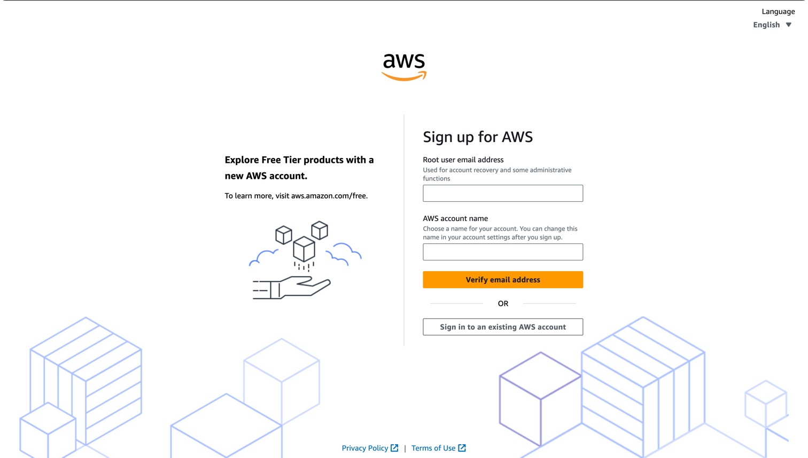
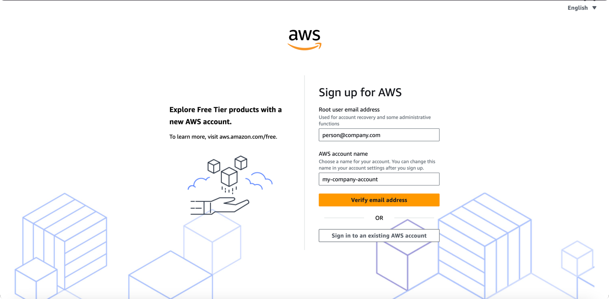
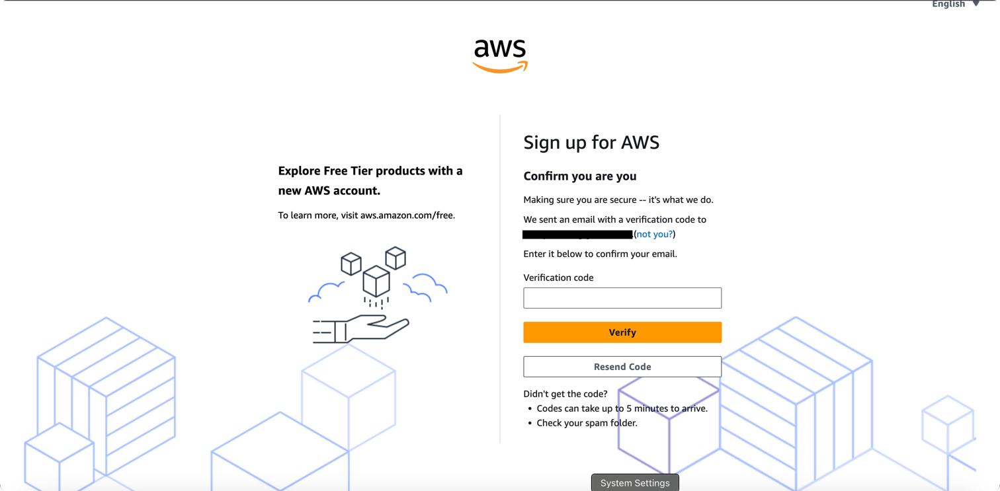
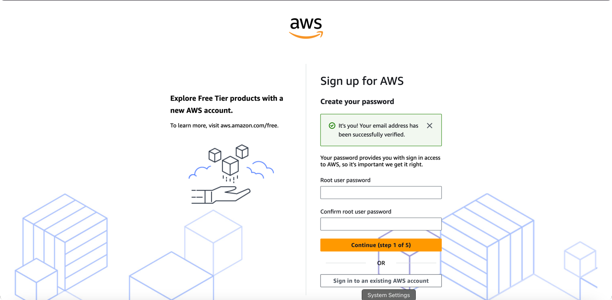
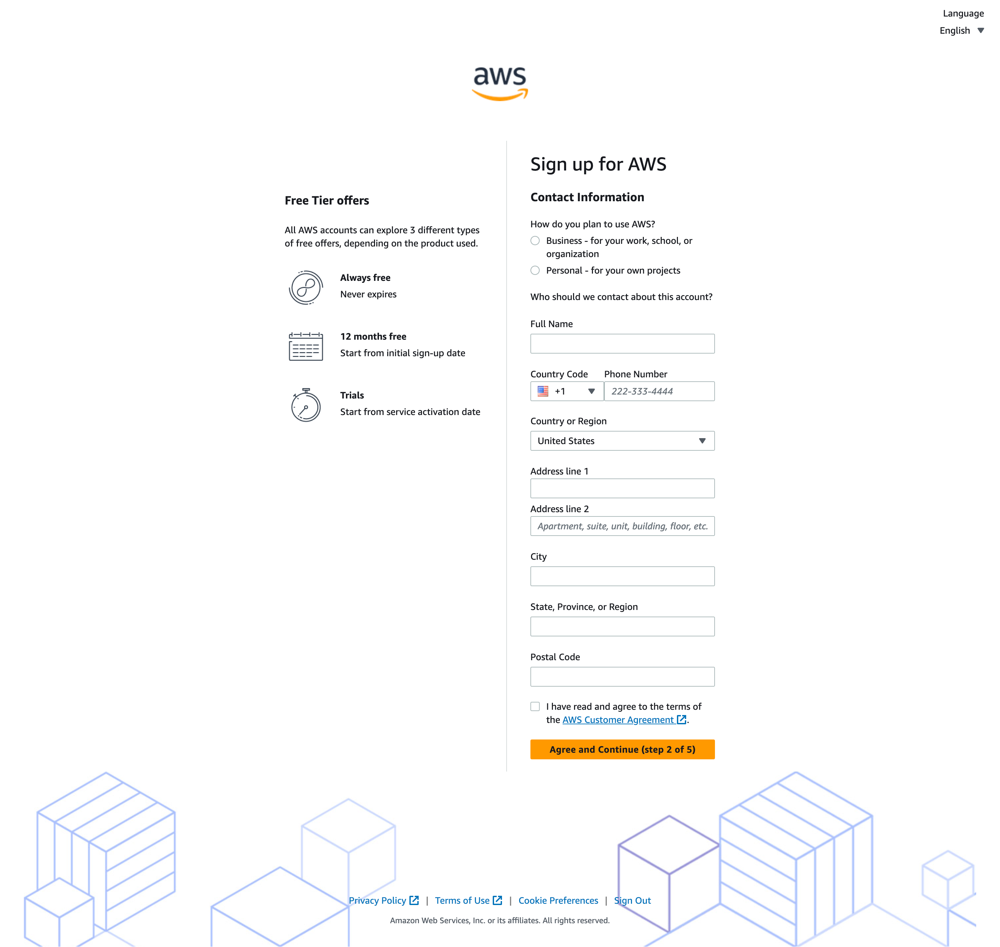
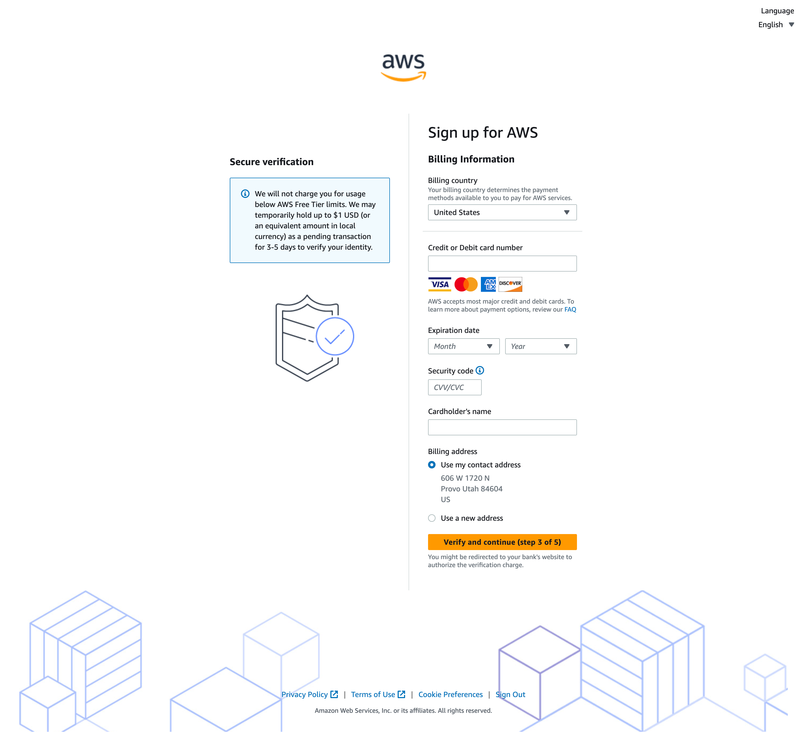
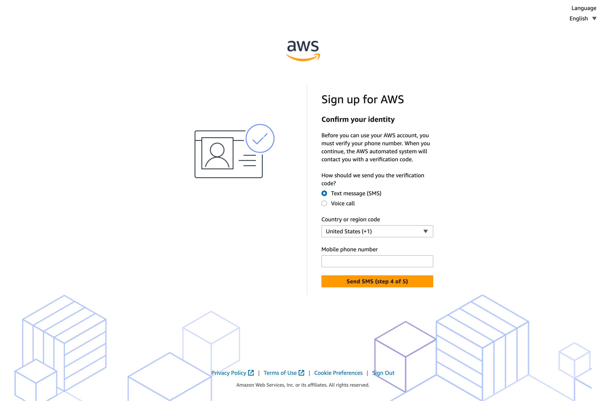
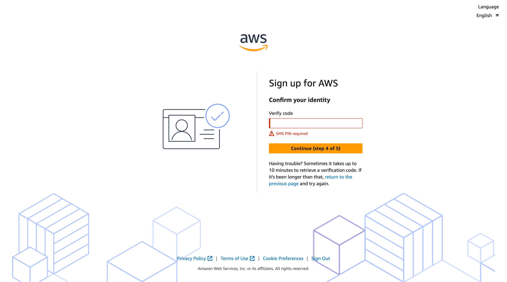
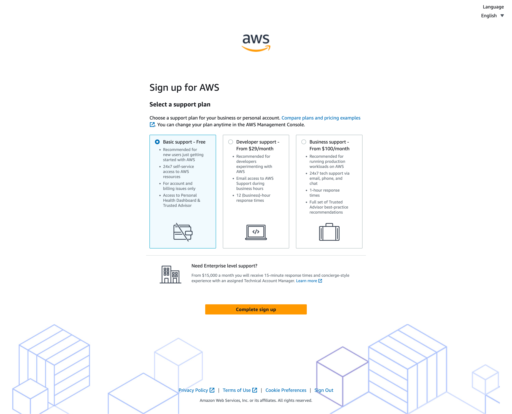
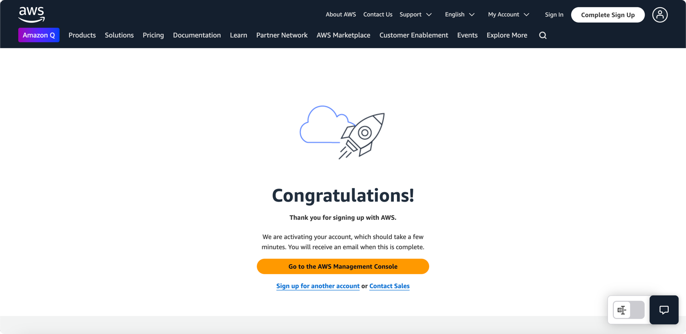

# **Important Prerequisites**

* **You need an Apple computer:** In order to run the iOS App, you must have a mac running Sonoma (macOS 14) or greater, but latest version of macOS is recommended. Apple Silicon (M-series chips) also highly recommended.
* **Kdoctor:** Run Kdoctor to ensure your environment is set up and ready for multiplatform development. To do this, you'll need Android Studio and XCode. Follow [this tutorial](https://www.jetbrains.com/help/kotlin-multiplatform-dev/multiplatform-setup.html).

# **Project Structure**

This is a Kotlin Multiplatform project targeting Android, iOS, and Desktop.
No work has been done on the Desktop target as of yet, but the target is available should you wish to use it.
A web target can be added if desired.

The app provides a simple UI for moving the solar array up and down.
Each button will send the array to its maximum and minimum safe angles.
This can of course be overridden using the master switch which takes precedence over the app.

* `/composeApp` is for code that will be shared across your Compose Multiplatform applications.
  It contains several subfolders:

  - `commonMain` is for code that’s common for all targets.
  - `commonTest` is for tests that will be run on all targets. We'll use this to test connection to AWS.
  - Other folders are for Kotlin code that will be compiled for only the platform indicated in the folder name.
    For example, if you want to use Apple’s CoreCrypto for the iOS part of your Kotlin app,
    `iosMain` would be the right folder for such calls.
  - `jvmMain` is the Desktop target.
* `/iosApp` contains iOS applications. Even if you’re sharing your UI with Compose Multiplatform,
  you need this entry point for your iOS app. This is also where you should add SwiftUI code for your project.

# **Tutorial**

This tutorial will be written assuming you know virtually nothing about Amazon Web Services, 
Android development, iOS development, and Kotlin Multiplatform. However, this tutorial _does_
assume that you know Git version control.

Though the app is simple, it's quite surprising how just about no documentation exists for connecting
an AWS IoT device to a KMP app.

## **Part 1: AWS**
### **1. Create an AWS Account**
If you don't have an AWS account, create one [here](https://signin.aws.amazon.com/signup?request_type=register).
If you already have an account, feel free to skip this step.

1. You'll be creating a root user account.
The created account that will be the root user and have access to _everything_.

_Because this account has access to everything, one of the first things that you should do after creating an account is to create an IAM user which adds an important layer of security to your account. 
An IAM user will have select access to certain account services. Therefore, if your account is compromised, the attacker will not have access to everything._

2. Enter your email and call your AWS account whatever you would like:

3. An email will be sent to you to verify your email address. Click the link in the email to verify your email address. 
Check your email and enter the verification code.

4. Upon verification, you'll then need to setup a root user password.

5. You'll then need to enter some more contact info. 
If you're a tinkerer, chose personal. 
If you're a business, chose business.

6. Next you'll need to enter account billing information. 
The free tier is quite generous in many cases. Most services are pay-as-you-go and won't charge you
until you've reached a usage limit. 

_If you make a mistake and leave a service running for a long time, you could be charged. Thankfully, 
Amazon is quite lenient and will often refund you if you make a mistake. Just make sure you say that 
you're new to AWS._

7. You'll then need to verify your identity. I chose SMS as the option.

8. Enter the SMS code to verify.

9. You'll then need to select a support plan. I would just choose free for now.

10. All done! You should be greeted with a page that looks something like this:

### **2. Create an IAM User**

TODO

## **Part 2: Connect AWS IoT Core to KMP App**

### **1. commonTest**