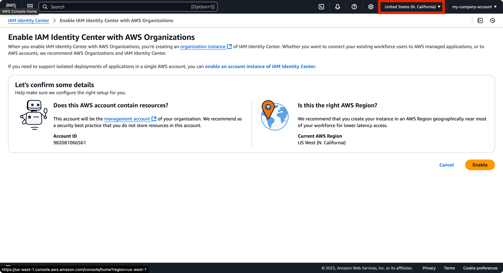
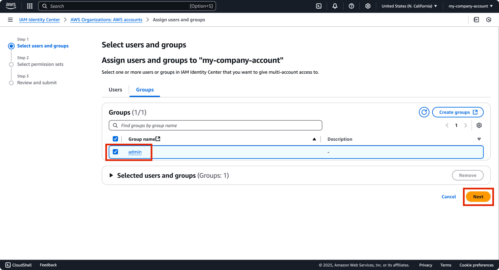
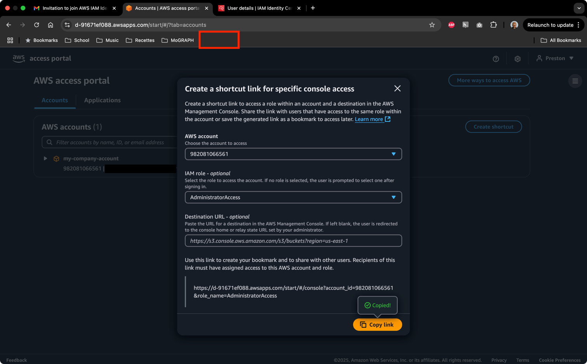
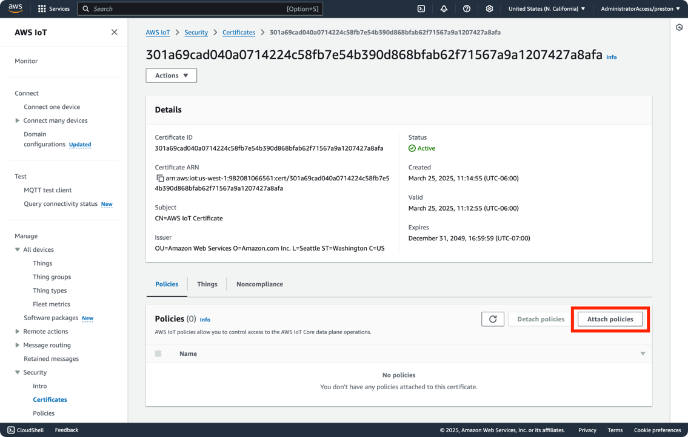

# **Important Prerequisites**

* **You need an Apple computer:** In order to run the iOS App, you must have a mac running Sonoma (macOS 14) or greater, but latest version of macOS is recommended. Apple Silicon (M-series chips) also highly recommended.
* **Kdoctor:** Run Kdoctor (not available for non macOS machines) to ensure your environment is set up and ready for multiplatform development. To do this, you'll need Android Studio and XCode. Follow [this tutorial](https://www.jetbrains.com/help/kotlin-multiplatform-dev/multiplatform-setup.html).

# **Project Structure**

This is a Kotlin Multiplatform project targeting Android, iOS, and Desktop.
No work has been done on the Desktop target as of yet, but the target is available should you wish to use it.
A web target can be added if desired.

The app provides a simple UI for moving the solar array up and down.
Each button will send the array to its maximum and minimum safe angles.
This can of course be overridden using the master switch which takes precedence over the app.

* `/composeApp` is for code that will be shared across your Compose Multiplatform applications.
  It contains several subfolders:

  - `commonMain` is for code that’s common for all targets.
  - `commonTest` is for tests that will be run on all targets. We'll use this to test connection to AWS.
  - Other folders are for Kotlin code that will be compiled for only the platform indicated in the folder name.
    For example, if you want to use Apple’s CoreCrypto for the iOS part of your Kotlin app,
    `iosMain` would be the right folder for such calls.
  - `jvmMain` is the Desktop target.
* `/iosApp` contains iOS applications. Even if you’re sharing your UI with Compose Multiplatform,
  you need this entry point for your iOS app. This is also where you should add SwiftUI code for your project.

# **Tutorial**

This tutorial will be written assuming you know virtually nothing about Amazon Web Services,
Android development, iOS development, and Kotlin Multiplatform. However, this tutorial _does_
assume that you know Git version control.

Though the app is simple, it's quite surprising how just about no documentation exists for connecting
an AWS IoT device to a KMP app.

## **Part 1: Setup AWS Account**

If you already have an account OR you are going to be using someone else's account, feel free to skip this part.

### **1. Create an AWS Account**

If you don't have an AWS account, create one [here](https://signin.aws.amazon.com/signup?request_type=register).

1. You'll be creating a root user account. The created account that will be the root user and have access to _everything_.


_Because this account has access to everything, one of the first things that you should do after creating an account is to create an IAM Identity Center user which adds an important layer of security to your account.
This user will have select access to certain account services. Therefore, if your account is compromised, the attacker will not have access to everything._

2. Enter your email and call your AWS account whatever you would like. I don't recommend calling yours "my-company-account", but for the purposes of this tutorial that's what I'll call it.


3. An email will be sent to you to verify your email address. Click the link in the email to verify your email address.
   Check your email and enter the verification code.


4. Upon verification, you'll then need to setup a root user password.


5. You'll then need to enter some more contact info.
   If you're a tinkerer, chose personal.
   If you're a business, chose business. For this tutorial, I chose business.


6. Next you'll need to enter account billing information.
   The free tier is quite generous in many cases. Most services are pay-as-you-go and won't charge you
   until you've reached a usage limit.

_If you make a mistake and leave a service running for a long time, you could be charged. Thankfully,
Amazon is quite lenient and will often refund you if you make a mistake. Just make sure you say that
you're new to AWS._


7. You'll then need to verify your identity. I chose SMS as the option.


8. Enter the SMS code to verify.


9. You'll then need to select a support plan. I would just choose free for now.


10. You should be greeted with a page that looks something like the picture below. Go ahead and click on "Go to the AWS Management Console".


## **Part 2: User Permissions with IAM Identity Center and CloudTrail**

*Note: If you will be using someone else's root AWS account, wait for them to complete this step for you.*

IAM stands for **Identity and Access Management**. By creating an admin user for yourself, you can login as this user instead of using the root account you just made in the last step.

**Now this is a very important step that should not be skipped!**

Why? This substantially decreases security risk. If someone manages to steal your admin user, this is still better than them stealing the root user because they won't be able to do things like delete your account or other root-exclusive functions. Imagine having users who pay good money for your product. What would happen if all of a sudden your account was deleted because someone got access to your root user account and deleted it?

Beyond the risks associated with bad actors (hackers), think of the risks associated with allowing your own associates access to AWS resources. Though typically done through ignorance, they can accidentally consume expensive resources. It's important to limit permissions so that this is less likely to happen. I'll show you how to determine what permissions to assign.

Now there are two services that exist in AWS that each have IAM in the name. There's "IAM" and "IAM Identity Center". It's a little confusing, but AWS recommends the latter when it comes to registering a human user which is what we'll be doing.

### **1. Create a User in IAM Identity Center**

First thing's first, let's create a user for yourself that you can use to log in to without logging into the root user.

1. The page I'm currently on is the Console Home page which is the page you should be on if you are continuing from the last step. Otherwise, log in (if not already logged in) and it should be the first page you see. No matter what page you're on, you should have access to the search bar. Use it and type in "IAM" then click on "IAM Identity Center"


2. If you're greeted with this page, click "Enable". Otherwise continue on to the next step


3. This page asks to confirm that you're in the right AWS region. You can change the region by selecting the dropdown next to your account name in the top right corner and choosing the region closest to you. N. California (us-west-1) is closest to me.



4. You should now be greeted with a page that looks like this. Click on Users on the left side menu.


5. Now click add user.


6. Now if this is your first time creating a user, I would start by creating a user for yourself. Since my name's Preston, I'll put "preston" for the user name and fill out the rest of the information. I didn't fill out any of the other drop-down fields.


7. In a future step, we will create a new user group. For now, just click on "Next".


8. Now it will just prompt you to review the information. You can click "Add user" to complete this process.


9. Now you'll notice the green dialog confirming a user has been made and an email has been sent to the user allowing them to sign in. Let's add permissions before we sign in to the user. Click on "Groups" on the left side menu.


### **2. Add the User to a Group**

This step makes it really convenient to give users access to certain permissions. Let's say you've got a partner you're working with that knows their way around AWS. I would make an admin group where you and your partner will have administrator access privileges. Perhaps you've got engineers that are part of an engineering team. They don't need access to DynamoDB or other services, but they do need access to IoT Core. You could create an "engineer" group and assign those specific permissions to the engineer group.

1. Navigate to the Groups page by clicking on it from the left menu. Then click on "Create group"


2. Now we'll create the admin group. If you have partners working with you or other people that need admin privileges, you can add them to this group as well. I'll call the group "admin", select the user I just made "preston", and then hit "Create group"


3. You should now be greeted with this page. Click on "Permission sets" on the left menu.


### **2. Add Permissions to the Group**

Permissions are how we can give our group access to services on AWS.

1. Navigate to the Permissions Sets page under Multi-account permissions. Click "Create permission set"


2. Use default settings for the permission type. It will be the AdministratorAccess predefined permission set. Click "Next".


3. I'm also going with the default settings here. Hit "Next".


4. Again didn't change anything. Go ahead and click "Create".


5. You should now have the permsssion set appear in your Permission sets.


6. Now head over to the AWS Accounts page. Select your company account (yours is likely different if you have a different account name), then click on "Assign users or groups"


7. Select the admin group that you just made and hit "Next".



8. Select the permission you previously made (AdministratorAccess) and hit "Next".


9. Review the information and hit "Submit".


10. You should now see the AdministatorAccess permission set assigned to the management account.


### **2. Add Permissions to the Group**

1. Now you can sign in as the user you just created earlier. Check the email that you used to create the user and click the link to sign in from you mail inbox. Here's what the email looked like on my end:


2. The link should take you to a page that looks like this. Set up your username/password here.


3. Sign in with the username that you formerly created (mine was "preston").


4. Enter the password you just created.


5. Now you'll be required to setup Multi-Factor Authentication (MFA). I chose "Built-in authenticator" since it's quite convenient when you have a fingerprint scanner. Otherwise, I would choose "Authenticator app". You'll need an app like Duo or Okta Verify that will give you a code that refreshes periodically.


6. After I was prompted to add my authentication, I was taken to this screen. Go ahead and click "Done".


7. At this point it asked me to sign in again. I entered my username followed by my password and my MFA and was greeted with this screen. The first thing we'll do is create a shortcut so that you can easily access AWS using this new user you created.


8. Click on the dropdown and you should be able to select your account.


9. Next select the AdministratorAccess permission from the next dropdown. If you skip this step, you'll just be prompted to select it later.


10. Now click on the "Copy link" button. On Google Chrome, you can easily create a new bookmark by right clicking on the bookmarks bar and selecting "Add page", then pasted the copied link into the URL field.





11. You should now have an easy-access bookmark in your bookmarks bar. Use this to sign in from now on.


12. We're so close! Now click on the account dropdown and select "AdministratorAccess"


13. You should now be signed in to AWS console as the user you've created now! Notice the AdministratorAccess/<yourusername> permission in the top right corner.


## **Part 2: Setup AWS IoT Core**

### **1. Create a Thing in AWS IoT Core**

This will involve all of the steps necessary to get AWS IoT Core ready to receive messages from your Kotlin Multiplatform app.

1. If you're not already signed in using the new sign in you created in the last steps, sign in and navigate to AWS IoT Core. If you don't see it in your recently visited, type it in the search bar.


2. First, we'll create a new Thing in IoT Core. Navigate to Things by clicking on All devices->Things. The "Connect a single device" tutorial that is visible when you access IoT Core was unfortunately not helpful for our purposes.


3. Click on "Create things"


4. Click on "Create single thing"


5. Enter a name for your thing. I called mine "Esp32". Click "Next" and leave all other settings to their defaults.


6. Click on "Auto-generate a new certificate" then hit "Next".


7. Click "Create thing". We'll attach policies in the future.


8. Important! Make sure you download the certificate file as shown (device certificate, private key, public key, and the Root CA 1 Certificate). We won't need the public key, but we have to download it to move past this dialogue. I renamed the 3 certificates to "device_cert.crt", "private.pem.key", and left the Root CA 1 as its default "AmazonRootCA1.pem"


9. You should be brought to this page now


### **2. Attach policies to the Thing in AWS IoT Core**

Policies are similar to the IAM permissions we set up earlier. Policies are essentially "permissions", but only pertain to an IoT device. We have to set some up so that we can connect a device to IoT Core.

1. Scroll down on the left menu bar until you find Security->Policies and select it.


2. Click on "Create policy"


3. Enter a name for the policy. I chose "Esp32Policy". Now there's a Builder/JSON section for defining the policy. All policies/permissions are essentially JSON strings. The Builder makes it easy to make this JSON String without having to write it out yourself. Before we move on, let's explore how to build these policies.


4. Here is some [important documentation](https://docs.aws.amazon.com/iot/latest/developerguide/iot-action-resources.html) on building policies. The 3 policy Actions that we will need are "iot:Connect" (to connect our device), "iot:Publish" (to publish messages to the ESP32), and "iot:Subscribe" (to listen for messages from the ESP32). Each of these actions has a particular Amazon Resource Name (ARN) associated with it.
5. This is the general format for an ARN in IoT Core: `arn:partition:iot:region:AWS-account-ID:Resource-type/Resource-name`. For our purposes, the `partition` will always be `aws`. My region is `us-west-1`. You can find your region by clicking on the region dropdown in the top right corner.
   


6. The `AWS-account-ID` can be found by clicking on your account name in the top right corner. Don't put the hyphens in the ARN. My account ID is `982081066561`.


7. You can find the `Resource-type` by referring back to the [documentation](https://docs.aws.amazon.com/iot/latest/developerguide/iot-action-resources.html). For the `iot:Connect` action, the Resource-type is `client`. For the `iot:Publish` action, the Resource-type is `topic`. For the `iot:Subscribe` action, the Resource-type is `topicfilter`.
8. The `Resource-name` is the name of the resource you're trying to access. For the `iot:Connect` action, it's the name of your clientId. For the `iot:Publish` action, the Resource-name is the topic name(s) you will be publishing to. For the `iot:Subscribe` action, the Resource-name is topic(s) you will be subscribed to. What will we put? The magical wildcard `*`. This wildcard says "anything goes here". This is albeit less secure, but it's an easy way to get started communicating with.
9. Here is the final state of our resource ARNs. The only differences will be in your **account number** and your potentially your **region** as well.
   iot:Connect: `arn:aws:iot:us-west-1:982081066561:client/*`
   iot:Publish: `arn:aws:iot:us-west-1:982081066561:topic/*`
   iot:Subscribe: `arn:aws:iot:us-west-1:982081066561:topicfilter/*`
10. Now let's start building out the policy. Go back to the AWS IoT Core page, make sure iot:Connect is the action, and fill out your ARN (remember **_NOT_** mine, but yours). Click "Add new statement" for the others.


11. Fill out the remaining Publish and Subscribe statements. Here's what mine look like. Hit "Create" when you're done.


12. You should now see your created policy on this page.


13. Now click on "Things" on the left menu bar and navigate to the thing you created earlier.


14. Click on "Certificates" then the Certificate ID.


15. Click on "Attach policy"



16. Click on the dropdown and assign the policy you just created.


17. You should now have a green confirmation message that the policy was applied.


18. Now head over to the "MQTT test client" and copy the endpoint. We'll need this for the next step. 


## **Part 3: Test KMP Connection to AWS IoT Core**

Now we can finally get our hands dirty by working with the code itself.

### 1. Input Endpoint, Server Certificate, and Device Certificate into MqttManager

MqttManager is the basis of communication between AWS and KMP. It uses a repository called KMQTT. You can read more about it here [https://github.com/davidepianca98/KMQTT](https://github.com/davidepianca98/KMQTT).

To setup the MqttManager, we'll need the certificates you downloaded from AWS as well as the IoT endpoint.

1. If you're new to Android Studio, sometimes it loads up configured for Android development. Change this by clicking on the dropdown in the top right corner and selecting "Project". This will show you all of the files in the project. It's ok if our projects look a little bit different (they likely will). 


2. Move/copy all of the certificates/keys you downloaded from AWS into the `composeApp/src/commonTest/resources` folder. If prompted, **DO NOT** add these files to the git repository! If you do, you will have to generate new keys and certificates. They should automatically be added to the `.gitignore` file (located at the root of the project) so that this doesn't happen, but just in case they don't, you've been warned. 


3. Go to MqttManager located in `composeApp/src/commonMain/kotlin/org/example/project/MqttManager.kt`.


4. Replace the `AWS_ENDPOINT` with your AWS endpoint you copied from the end of the last part.
5. If you named your certificates the same as mine, you shouldn't need to change the names for the `SERVER_CERT` (AmazonRootCA1.pem) and the `CLIENT_CERT` (device_cert.crt). If you did, you'll need to change the names to match your certificates.

### 2. Input the Converted Private Key into MqttManager
The `PRIVATE_KEY` works a little differently. You actually need to convert the private key that you downloaded from AWS from a PKCS1 format to a PKCS8 format (took a lot of trial and error to figure this out).
1. Open a terminal by using View->Tool Windows->Terminal. This will automatically open a command terminal at the root of the project. Alternatively, you may be able to find it in the bottom-left corner of your screen (pictured below)


2. Locate the resources directory by entering this command into the terminal.

```shell
cd composeApp/src/commonTest/resources
```

3. Now convert the private key to PKCS8 format by entering this command into the terminal.

```shell
openssl pkcs8 -topk8 -inform PEM -outform PEM -nocrypt -in private.pem.key -out pkcs8_key.pem
```

4. You should now see a new file called `pkcs8_key.pem` in the resources directory.


5. If you used the same terminal command as me, you shouldn't have to change anything, but just make sure that your `PRIVATE_KEY` in `MqttManager.kt` is set to `pkcs8_key.pem` or whatever you decided to call the output file.

### 3. Run the MqttManagerTest File.

1. Open the `MqttManagerTest.kt` file located in `composeApp/src/commonTest/kotlin/org/example/project/MqttManagerTest.kt`.
